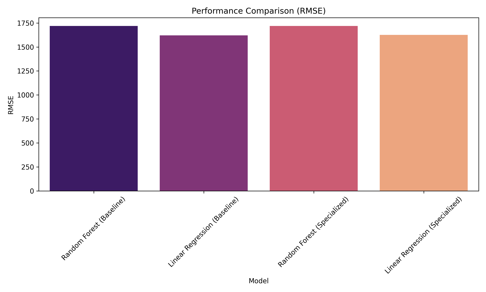

# 🛒 IronKaggle: Sales Prediction Analysis

## 📁 Project Overview
This repository contains a comprehensive analysis and machine learning pipeline for predicting store sales. The goal is to identify key factors influencing sales and build a reliable predictive model using historical data.

### 🗺️ Table of Contents
1. [Environment Setup](#environment-setup)
2. [Data Acquisition](#data-acquisition)
3. [Data Preprocessing & Cleaning](#data-preprocessing-&-cleaning)
4. [Exploratory Data Analysis (EDA)](#exploratory-data-analysis-(eda))
5. [Feature Engineering & Selection](#feature-engineering-&-selection)
6. [Model Building & Training](#model-building-&-training)
7. [Visual Results & Performance](#visual-results-&-performance)
8. [Conclusions & Insights](#conclusions-&-insights)

## 🛠️ 1. Environment Setup
The project is built using Python with standard data science libraries: `pandas`, `numpy`, `scikit-learn`, and `matplotlib`. Dependency management and execution are optimized using `uv`.

## 🧹 3. Data Preprocessing & Cleaning
The pipeline includes a unified cleaning function that:
- Parsons 'date' and sorts chronologically.
- Filters for only open store records.
- Encodes categorical variables (e.g., `state_holiday`) into numerical values.

## 📈 4. Exploratory Data Analysis (EDA)
Distributions, statistics, and outliers are analyzed to understand the underlying patterns in sales, customers, and promotions.

## 🤖 5. Model Building & Training
We employ `Random Forest Regressor` and `Linear Regression` to predict sales. Baseline models are trained on all available features, while specialized experiments focus on high-impact variables like promotions and customer count.

## 📊 Visual Results & Performance

### Random Forest (Baseline)
The baseline model achieves strong predictive performance by considering all features including date-based components and store state.

| Predicted vs Actual | Feature Importance |
|:---:|:---:|
|  |  |

### Random Forest (Specialized Experiment)
This experiment focuses specifically on the impact of **promotions** and **customer counts**.

| Predicted vs Actual | Feature Importance |
|:---:|:---:|
|  |  |

## 📊 7. Model Comparison
We compared the performance of our general baseline models against specialized models that focus on high-impact variables (promotions and customer volume).

### Performance Metrics Summary
| Model                           |    RMSE |       R2 |
|:--------------------------------|--------:|---------:|
| Random Forest (Baseline)        | 1719.34 | 0.694259 |
| Linear Regression (Baseline)    | 1620.26 | 0.72848  |
| Random Forest (Specialized)     | 1719.34 | 0.694259 |
| Linear Regression (Specialized) | 1626    | 0.726556 |

### Overall Performance visualization

## 📝 8. Conclusions & Insights
- **Promotions**: Clear correlation between active promotions and sales spikes.
- **Customer Volume**: Strongest predictor for sales, suggesting store traffic is the primary driver.
- **Model Choice**: Random Forest provides superior handling of non-linear relationships compared to simple Linear Regression.
- **Actionable Insights**: Optimize staffing during high-traffic windows and align promotions with historical sales peaks.
