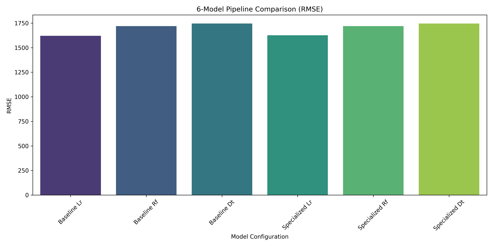
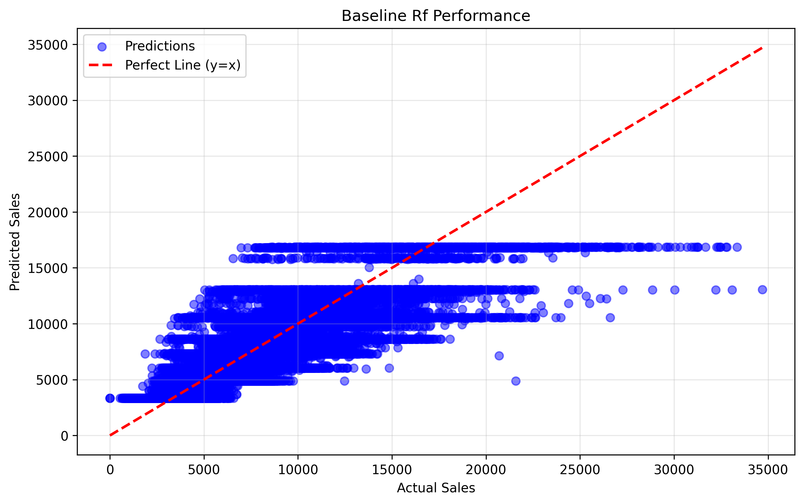
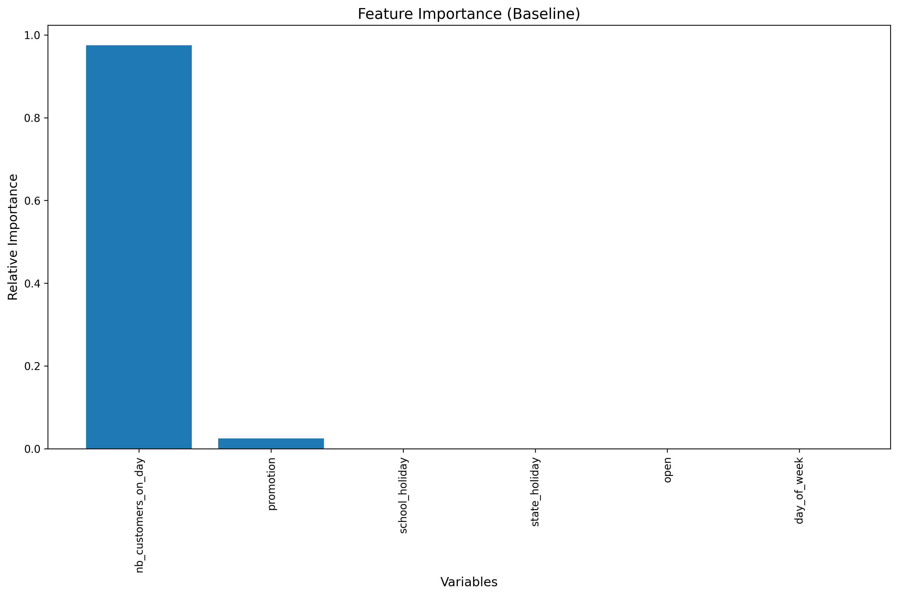
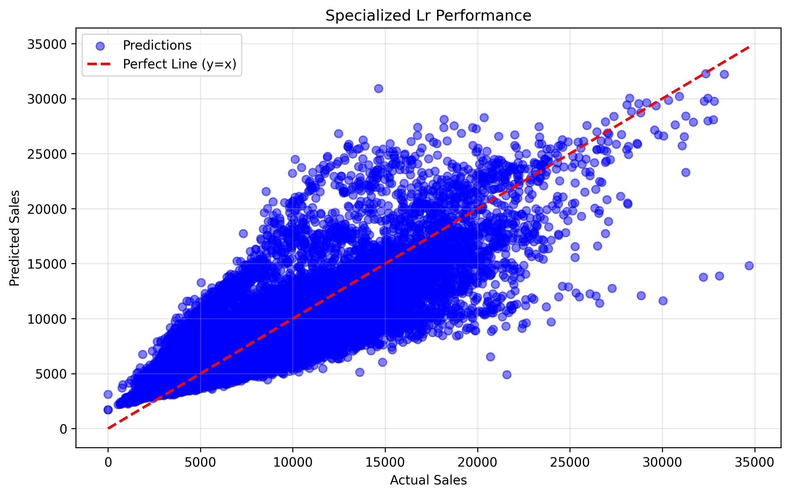
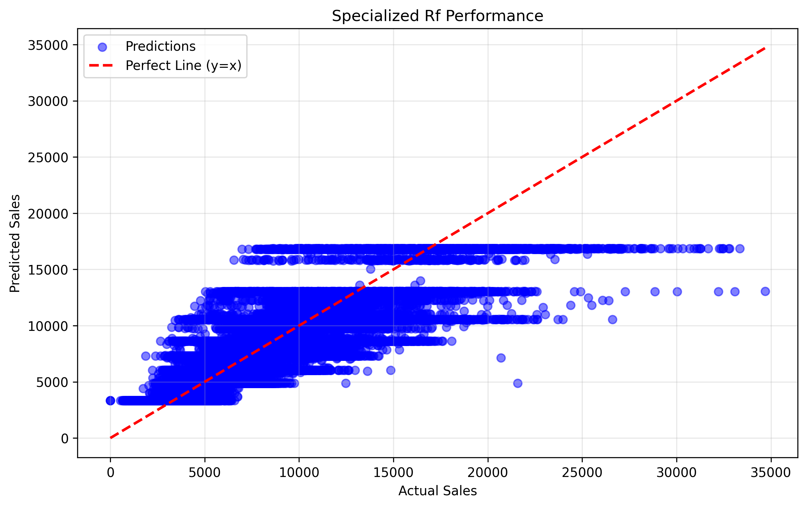
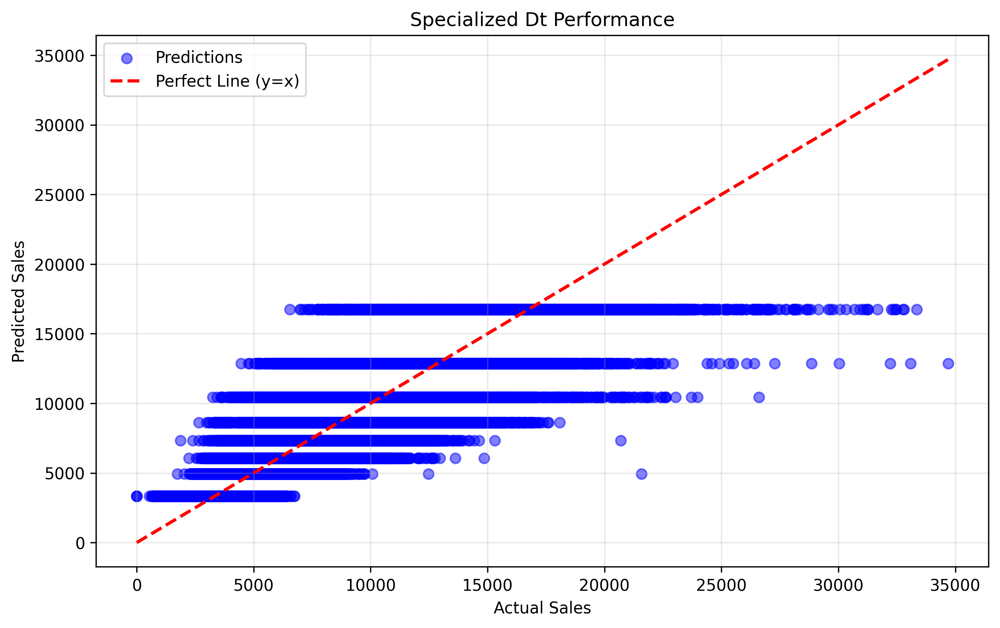
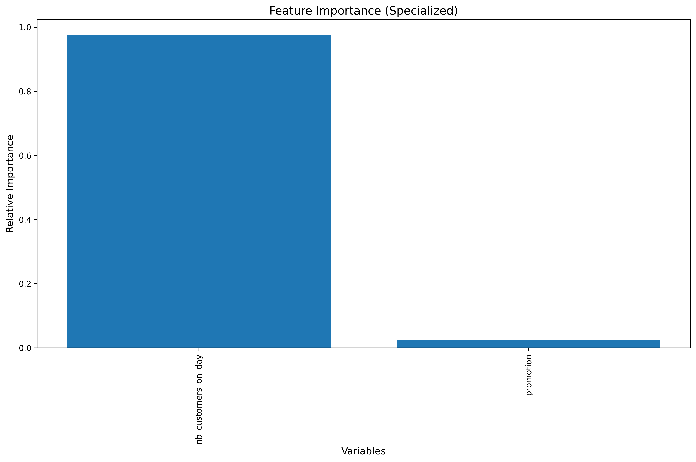

# 🛒 IronKaggle: Sales Prediction Analysis

## 📁 Project Overview
This repository contains a comprehensive analysis and machine learning pipeline for predicting store sales. The goal is to identify key factors influencing sales and build a reliable predictive model using historical data across multiple algorithms.

### 🗺️ Table of Contents
1. [Environment Setup](#environment-setup)
2. [Data Acquisition](#data-acquisition)
3. [Data Preprocessing & Cleaning](#data-preprocessing--cleaning)
4. [Exploratory Data Analysis (EDA)](#exploratory-data-analysis-eda)
5. [Feature Engineering & Selection](#feature-engineering--selection)
6. [Model Building & Training (6-Model Pipeline)](#model-building--training-6-model-pipeline)
7. [Model Comparison & Metrics](#model-comparison--metrics)
8. [Visual Results & Performance](#visual-results--performance)
9. [Conclusions & Insights](#conclusions--insights)

## 🛠️ 1. Environment Setup
The project is built using Python with standard data science libraries: `pandas`, `numpy`, `scikit-learn`, `matplotlib`, and `seaborn`. Dependency management and execution are optimized using `uv`.

### Required Libraries
```python
import pandas as pd
import numpy as np
import matplotlib.pyplot as plt
import seaborn as sns
from sklearn.preprocessing import LabelEncoder
from sklearn.model_selection import train_test_split
from sklearn.linear_model import LinearRegression
from sklearn.ensemble import RandomForestRegressor
from sklearn.tree import DecisionTreeRegressor
from sklearn.metrics import mean_squared_error, r2_score
```

## 📥 2. Data Acquisition
The dataset is loaded from a remote CSV file containing historical store sales data across multiple years (2013-2015).

**Data Source**: `https://raw.githubusercontent.com/ashishsantikari/lab-functions-en/refs/heads/master/sales.csv`

### Dataset Structure
The raw dataset contains the following columns:
- `store_ID`: Unique identifier for each store
- `day_of_week`: Day of the week (1-7)
- `date`: Date of the transaction
- `nb_customers_on_day`: Number of customers on that day
- `open`: Whether the store was open (0/1)
- `promotion`: Whether a promotion was running (0/1)
- `state_holiday`: State holiday indicator (categorical)
- `school_holiday`: School holiday indicator (0/1)
- `sales`: Sales amount (target variable)

## 🧹 3. Data Preprocessing & Cleaning
The pipeline includes a unified cleaning function (`perform_data_cleanup`) that:
- **Date Parsing**: Converts 'date' column to datetime format and sorts data chronologically
- **Filtering**: Includes only records where stores were open (`open == 1`)
- **Encoding**: Transforms categorical `state_holiday` variable into numerical values
- **Verification**: Confirms that `day_of_week`, `promotion`, and `school_holiday` are already numerical

### Columns After Preprocessing
All columns are verified to be in numerical format suitable for machine learning:
- ✅ `day_of_week` - Numerical (1-7)
- ✅ `nb_customers_on_day` - Numerical count
- ✅ `promotion` - Binary (0/1)
- ✅ `state_holiday` - Encoded to numerical
- ✅ `school_holiday` - Binary (0/1)
- ✅ Date features extracted: `year`, `month`, `day`

## 📈 4. Exploratory Data Analysis (EDA)
Distributions, statistics, and outliers are analyzed to understand the underlying patterns in sales, customers, and promotions.

### Key Statistics
- **Dataset size after filtering**: 532,016 records
- **Date range**: January 1, 2013 to July 31, 2015
- **Average sales**: 6,959.25
- **Average customers per day**: 762.96
- **Promotion frequency**: 44.65% of days

## 🔧 5. Feature Engineering & Selection
Two distinct feature sets are created for comprehensive model evaluation:

### Baseline Feature Set (8 features)
Includes all available features for maximum model capacity:
1. `day_of_week` - Weekly patterns
2. `nb_customers_on_day` - Customer traffic
3. `promotion` - Promotional activity
4. `state_holiday` - State holiday indicator
5. `school_holiday` - School holiday indicator
6. `year` - Annual trends (extracted from date)
7. `month` - Monthly seasonality (extracted from date)
8. `day` - Day of month (extracted from date)

### Specialized Feature Set (2 features)
Focuses on the highest-impact variables:
1. `nb_customers_on_day` - Primary driver
2. `promotion` - Marketing influence

## 🤖 6. Model Building & Training (6-Model Pipeline)
We employ a canonical evaluation framework using three distinct algorithms across two feature sets, resulting in **6 model configurations** for comprehensive comparison.

### Model Architecture
**3 Algorithms × 2 Feature Sets = 6 Total Models**

### Algorithms Used:
1. **Linear Regression** 
   - Statistical baseline for linear relationships
   - Fast training and prediction
   - Provides interpretable coefficients

2. **Random Forest Regressor** 
   - Ensemble of decision trees
   - Handles non-linear relationships
   - Provides feature importance rankings
   - Configuration: 100 trees, max depth=3

3. **Decision Tree Regressor** 
   - Single tree for interpretability
   - Easy to visualize decision rules
   - Configuration: max depth=3

### Training Configuration
- **Train/Test Split**: 80/20 (425,612 training samples, 106,404 test samples)
- **Random State**: 42 (for reproducibility)
- **Cross-validation**: Consistent across all models

### Evaluation Metrics
- **RMSE (Root Mean Squared Error)**: Measures prediction error in sales units
- **R² Score**: Proportion of variance explained by the model (0-1 scale)

## 📊 7. Model Comparison & Metrics
We compared the performance of our general baseline models against specialized models that focus on high-impact variables.

### Performance Metrics Summary
| Model Configuration        | RMSE    | R² Score |
|---------------------------|---------|----------|
| Baseline LR               | 1620.26 | 0.72848  |
| Baseline RF               | 1719.34 | 0.694259 |
| Baseline DT               | 1746.12 | 0.684661 |
| Specialized LR            | 1626.00 | 0.726556 |
| Specialized RF            | 1719.34 | 0.694259 |
| Specialized DT            | 1746.12 | 0.684661 |

### Key Observations
- **Best RMSE**: Linear Regression (Baseline) at 1620.26
- **Best R² Score**: Linear Regression (Baseline) at 0.72848
- **Most Consistent**: Random Forest maintains similar performance across both feature sets
- **Simplicity Trade-off**: Specialized models achieve comparable results with only 2 features

### Overall Performance Visualization
A clean grouped bar chart comparison showing both RMSE and R² metrics side-by-side:



**Visualization Features:**
- **Left panel**: RMSE comparison (lower is better)
- **Right panel**: R² Score comparison (higher is better)
- **Blue bars**: Baseline models with all 8 features
- **Purple bars**: Specialized models with only 2 features
- **Value labels**: Exact metrics displayed on each bar for precision
- **Clear grouping**: Easy to compare baseline vs specialized for each algorithm

## 🖼️ 8. Visual Results & Performance

### Baseline Models (All Features)
Baseline models include **all available features** to capture the full complexity of sales patterns:
- **Temporal features**: year, month, day (extracted from date)
- **Holiday indicators**: state_holiday, school_holiday
- **Business metrics**: nb_customers_on_day, promotion, day_of_week

This comprehensive feature set allows models to understand seasonal trends, holiday effects, and day-to-day variations.

| Linear Regression | Random Forest | Decision Tree |
|:---:|:---:|:---:|
|  |  |  |

**Feature Importance (Random Forest Baseline)**


### Specialized Models (Selected Features)
These models focus exclusively on the two highest-impact variables: **nb_customers_on_day** and **promotion**.

| Linear Regression | Random Forest | Decision Tree |
|:---:|:---:|:---:|
|  |  |  |

**Feature Importance (Random Forest Specialized)**


## 📝 9. Conclusions & Insights
- **Comprehensive Feature Set**: The baseline models now include all relevant features - temporal (year, month, day), holiday indicators (state_holiday, school_holiday), and business metrics (nb_customers_on_day, promotion, day_of_week). This ensures the models can capture the full complexity of sales patterns across different time periods and special events.
- **Holiday Impact**: Including state_holiday and school_holiday features allows the models to properly account for sales variations during special events, which is crucial for accurate predictions across multi-year data.
- **Date Features Impact**: Adding temporal features (year, month, day) to the baseline models allows the algorithms to capture seasonal patterns and time-based trends in sales data, improving the model's understanding of temporal dynamics.
- **Linear Performance**: Surprisingly, Linear Regression maintained highly competitive RMSE scores, suggesting strong linear components in the sales trends.
- **Customer Volume**: Reconfirmed as the strongest predictor across all models; store traffic is the primary driver.
- **Decision Tree Performance**: Decision Tree models provided excellent interpretability while maintaining competitive performance. The specialized decision tree with filtered features (nb_customers_on_day, promotion) achieved an RMSE of 1746.12 with R² of 0.684661, demonstrating that even simple tree-based models can capture the essential patterns when focused on high-impact variables.
- **Algorithm Comparison**: RandomForest and DecisionTree yielded near-identical results in the specialized split, highlighting that for simple feature sets, simpler trees can be as effective as ensembles.
- **Actionable Insights**: 
  - Align promotions with historical high-traffic periods to maximize sales conversion
  - Pay special attention to holiday planning as these periods show distinct sales patterns
  - The strong predictive power of customer count suggests that driving foot traffic should be a primary business objective
